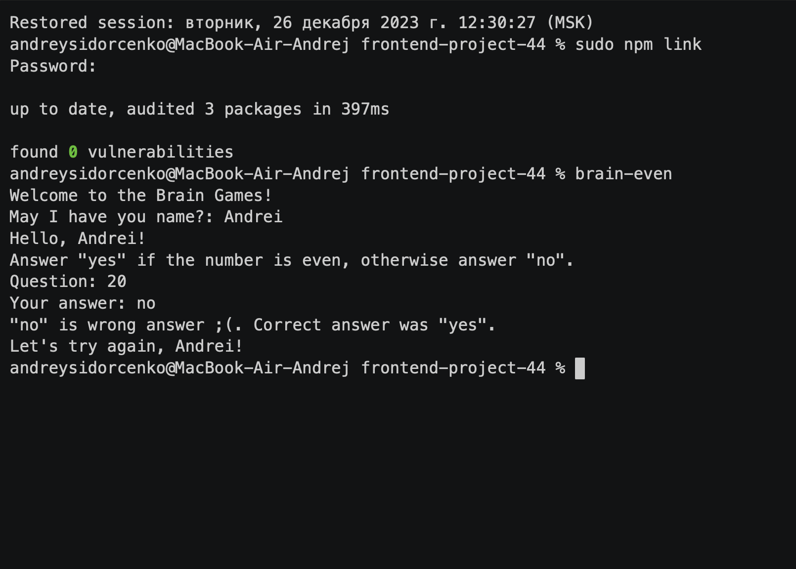
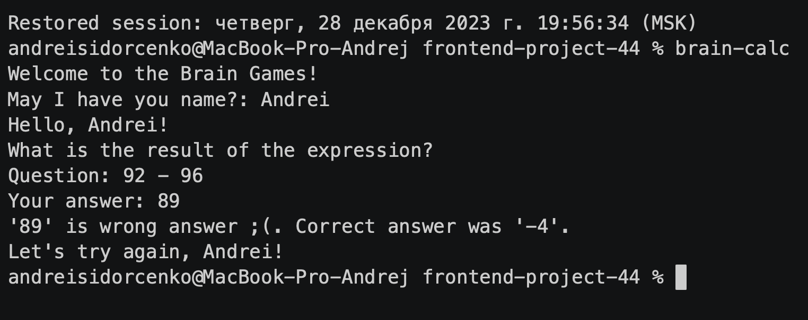
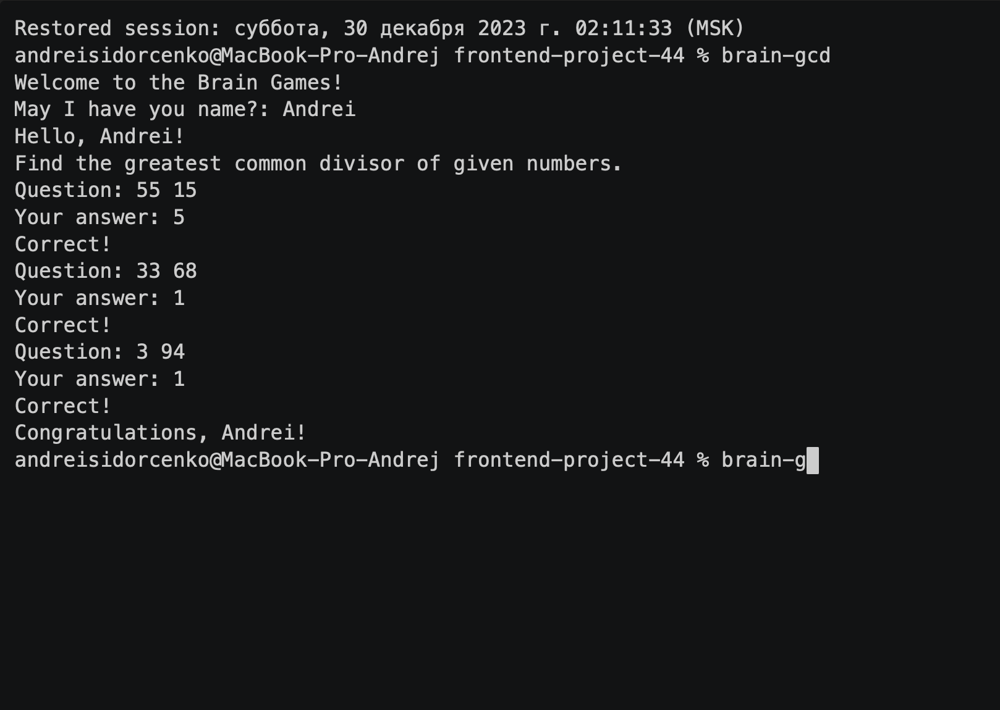
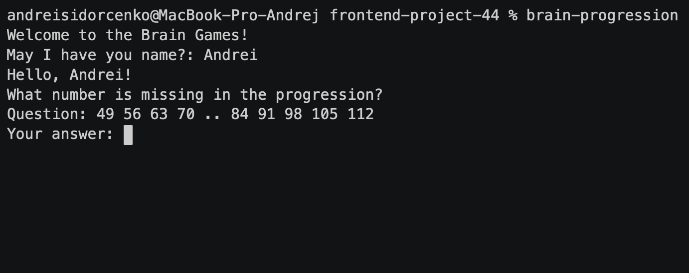
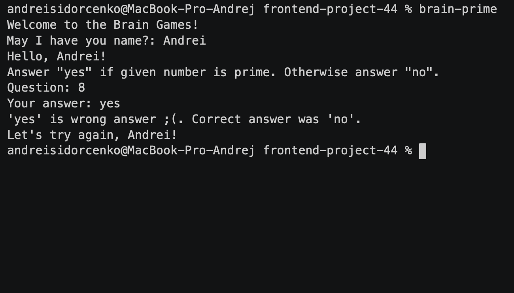

# Brain-Games

Brain Games is a collection of console-based logic games designed to train the mind and develop logical thinking. This project consists of several games, each of which assesses different aspects of logic and mathematics.

## Installation
To get started with Brain Games, follow these simple steps:

1. **Clone this repository:**
    git clone hhttps://github.com/Disielsida/frontend-project-44.git

2. **Navigate to the project directory:**
    cd frontend-project-44

3. **Install dependencies:**
    npm install

Now you're all set to enjoy and play the Brain Games on your local machine!

### Hexlet tests and linter status:

## Brain-even game

## Brain-calc game

## Brain-gcd game

## Brain-progression game

## Brain-prime game

## System Requirements
This project requires Node.js version 20.10.0 or higher.
Please make sure you have Node.js installed before proceeding with the setup.

